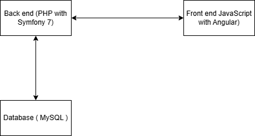

# Unfiltered
A web blog project

# Descriere
Proiectul web este conceput ca o platformă dedicată exprimării și conectării prin conținut scris. Scopul principal este de a oferi utilizatorilor un spațiu digital prietenos și intuitiv unde aceștia pot publica articole, împărtăși idei și interacționa cu alți membri ai comunității. Platforma își propune să promoveze conținutul de calitate, să faciliteze discuțiile constructive și să creeze o comunitate în care creativitatea și schimbul de idei sunt în centrul atenției.

# Specificații funcționale

Platforma va permite utilizatorilor să își creeze conturi pentru a accesa funcționalități personalizate, cum ar fi publicarea și editarea articolelor, gestionarea unui profil personal și urmărirea altor utilizatori. Vizitatorii vor putea explora conținutul disponibil printr-un sistem de categorii, tag-uri și o funcție de căutare avansată.

# Diagrama arhitecturala


# Procedura instalare back-end
- Asigura-te ca ai totul instalat:
  - PHP (ultima versiune suportată de symfony)
  - Composer
- Cloneaza proiectul din repository
  ```markdown
  git clone <url_repo>
  cd Backend/unfiltered-backend```
- Instalează dependențele cu Composer
  ```markdown
  composer install```
- Configurează variabilele de mediu
  - In '.env':
    ```markdown
    DATABASE_URL="mysql://<username>:<password>@127.0.0.1:3306/<nume_baza_date>"```
- Creeaza baza de date
  ```markdown
  php bin/console doctrine:database:create```
- Rulează migratiile
  ```markdown
  php bin/console doctrine:migrations:migrate```
- Porneste serverul
  ```markdown
  symfony server:start```
